# Lecture 3-3 逐页讲解：时序逻辑电路（Sequential Logic Circuits）

> 课件：`Lecture 3-3.pptx`（中科大《计算机系统概论》CS1002A.02，苗付友，2026 秋）
> 教材：Patt & Patel《Introduction to Computing Systems》第 3 章
>
> 详略安排：第 1–10 页开篇与复习**略讲**；第 11–31 页状态机与交通标志例题**精讲**；第 32–40 页数据通路与总结**点到为止**。

---

## 一、开篇与复习（第 1–10 页）· 略

**第 1 页 封面。** 这一讲是第 3 章的第三部分。第 3 章的主线是"从晶体管搭出一台计算机"，这一讲是收尾。

**第 2、3、10 页 目录。** 四部分：复习 → 时序逻辑 → 从逻辑到数据通路 → 总结。

**第 4 页 复习清单。** 回顾已经学过的几层：晶体管 → 门 → 存储元件（锁存器、触发器、寄存器、内存），以及已经搭过的加法器、减法器、加减法器、自增器。

其中有一句值得记住：**计数器 = 寄存器 + 自增器**。计数器其实就是最简单的状态机——寄存器存"当前值"，自增器算"下一个值"，每拍更新一次。后面讲的状态机就是它的一般化。

**第 5 页 基本逻辑结构。** 这一页把前两讲的电路拼在一起：

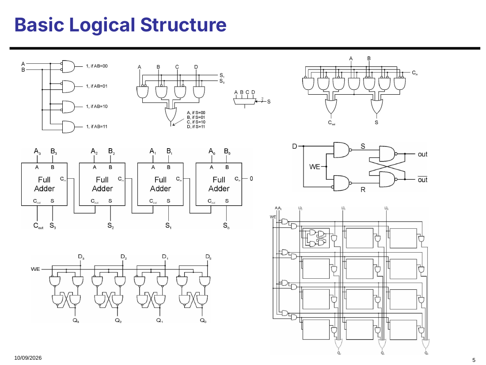
*图：第 5 页 · 前两讲电路汇总*

图中各块：
- **左上**：2-4 译码器。每个与门只在 AB 等于某一个特定值时输出 1。
- **中上**：4 选 1 多路选择器（MUX）。S1S0 选择把 A/B/C/D 中的哪一路送出去。
- **右上**：用积之和（PLA 形式）实现的全加器。
- **左中**：4 位行波进位加法器。最低位的进位输入 Cin 接 0，每一位的进位输出 Cout 接到高一位的 Cin。
- **右中**：门控 D 锁存器。WE = 1 时，D 的值写入 R-S 锁存器。
- **左下**：4 位寄存器，由 4 个门控 D 锁存器共用一根 WE 组成。
- **右下**：2² × 3 位内存。地址 A1A0 经过译码选中一行，WE 控制写入；读出时每列用"与门 + 大或门"，相当于一个 MUX。

  这张内存图把译码器、锁存器、MUX 三样东西串在了一起，值得会画。

**第 6 页 今天的内容。** 计算机本质上是一个状态机。今天先讲状态机，再看例子：可编程交通标志。

**第 7–9 页 抽象层次。**

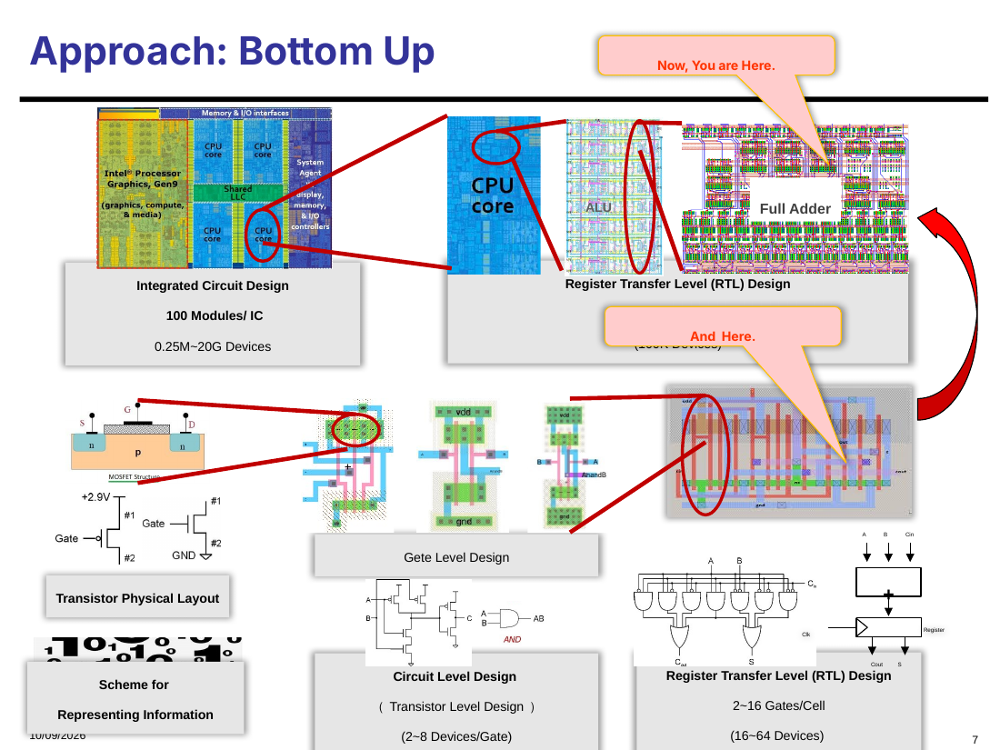
*图：第 7 页 · 自底向上：晶体管 → 门 → RTL → 集成电路*

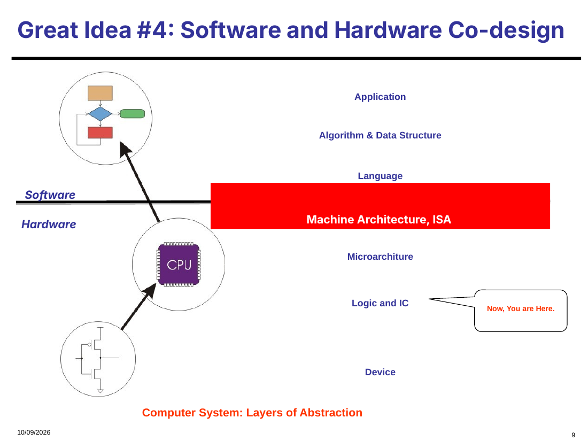
*图：第 9 页 · 软硬件分界在 ISA，我们目前处在 Logic and IC 这一层*

- 第 7 页讲设计层次：晶体管级（每门 2–8 个器件）→ 门级 → RTL 级 → 集成电路。"Now, You are Here" 标在全加器和门级版图上。
- 第 8 页是"伟大思想 #3"：用抽象管理复杂度。
- 第 9 页是"伟大思想 #4"：软硬件协同设计。从上到下是应用 → 算法 → 语言 → **ISA（软硬件分界）** → 微结构 → 逻辑电路 → 器件。

这几页了解即可，不用背。

---

## 二、时序逻辑电路（第 11–31 页）· 精讲

### 第 11 页：状态机是什么

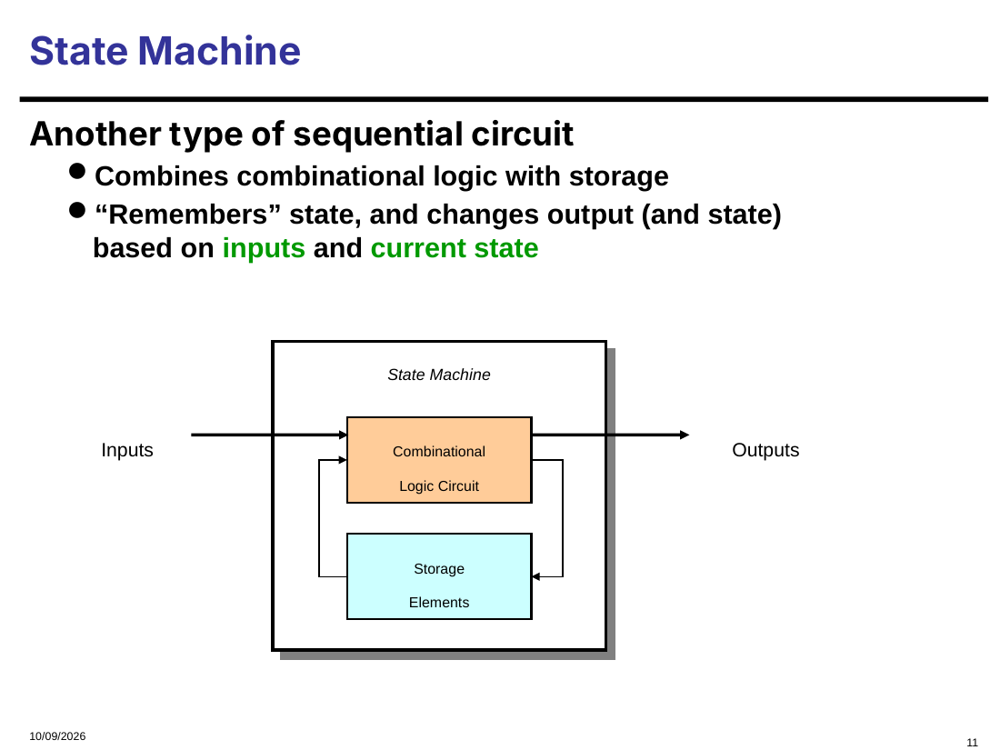
*图：第 11 页 · 状态机 = 组合逻辑 + 存储元件，存储的输出反馈回组合逻辑*

状态机由两部分组成：
- **组合逻辑**：输出只取决于此刻的输入，没有记忆。
- **存储元件**：把"当前状态"存下来，再反馈给组合逻辑。

所以，状态机的输出和下一状态都由**当前输入**和**当前状态**共同决定。图里那条从 Storage Elements 绕回 Combinational Logic 的线，就是"记忆"的来源。

### 第 12 页：组合锁 vs 时序锁

这是一个很好的类比：
- **组合锁**（比如行李箱的拨号锁）：数字都对就能开，跟拨的顺序无关，相当于组合逻辑。
- **时序锁**（比如保险柜的转盘锁）：必须先右转到 13，再左转到 22，再右转到 3。同样的三个数，顺序错了就打不开。

时序锁必须"记得"你已经完成了哪几步，这正是组合电路做不到的。

### 第 13 页：状态的定义

> 状态是在某一时刻，对系统所有**相关**元素拍的一张"快照"。

课件的例子是篮球比赛的记分牌：比分、剩余时间、球权等加在一起，就是比赛的状态。关键词是"相关"——观众穿什么衣服不算状态，因为它不影响比赛接下来怎么发展。

### 第 14 页：时序锁的四个状态

| 状态 | 含义 |
|---|---|
| A | 锁没开，还没完成任何有效操作 |
| B | 锁没开，已完成 R-13 |
| C | 锁没开，已完成 R-13 → L-22 |
| D | 锁已打开 |

### 第 15 页：状态图（重点，要会读）

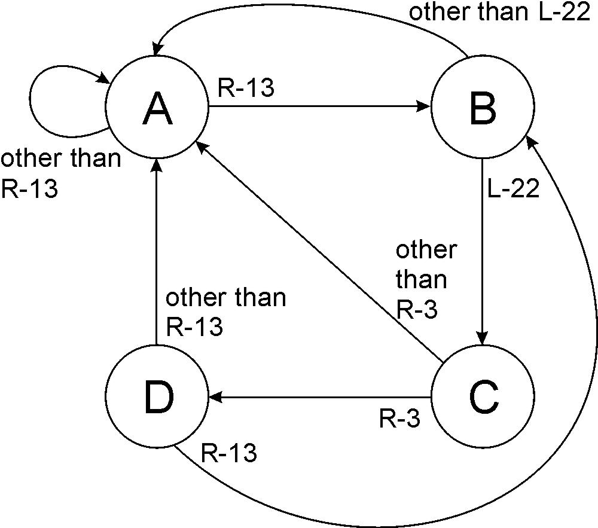
*图：第 15 页 · 时序锁的状态图*

- A：输入 R-13 → B；输入其他任何操作 → 留在 A（自环）。
- B：输入 L-22 → C；输入其他 → 回到 A。
- C：输入 R-3 → D（开锁）；输入其他 → 回到 A。
- D：输入 R-13 → B；输入其他 → 回到 A。

读状态图的两个要点：
1. **圆圈是状态，箭头是转移，箭头上标的是触发这次转移的输入。**
2. **每个状态对每一种可能的输入都必须有去向。** 这正是第 16 页说的"所有转移都要明确规定"。A 上的自环 "other than R-13" 就是为了覆盖其余所有输入。自己画状态图时，最常见的错误就是漏掉某个状态在某个输入下的去向。

> 为什么 D 在 R-13 下去的是 B，而不是 A？因为开锁之后再拨一次 R-13，相当于开始了新一轮开锁，并且第一步已经完成。能想明白这一点，就说明你读懂了状态图。

### 第 16 页：有限状态机（FSM）的五要素

1. 有限个状态；
2. 有限个外部输入；
3. 有限个外部输出；
4. 对所有状态转移的明确规定；
5. 对每个输出值由什么决定的明确规定。

最后两行要注意："Inputs may cause state transitions"（输入可能引起转移）；"Outputs are associated with each state (or with each transition)"（输出与状态挂钩，或与转移挂钩）。

- 输出只与状态有关的，叫 **Moore 型**，后面的交通标志就是这种；
- 输出与转移（状态 + 输入）有关的，叫 **Mealy 型**。

  课件没有出现这两个名词，但很多教材和考题会用，知道一下。

### 第 17 页：怎么实现一个 FSM

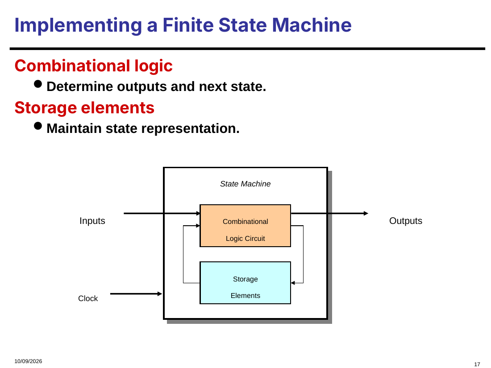
*图：第 17 页 · 和第 11 页相比，多了一根 Clock 接到存储元件*

- 组合逻辑：根据（当前状态，输入）算出（输出，下一状态）。
- 存储元件：保存当前状态。
- 时钟：决定**什么时候**把下一状态写进去。

### 第 18 页：时钟

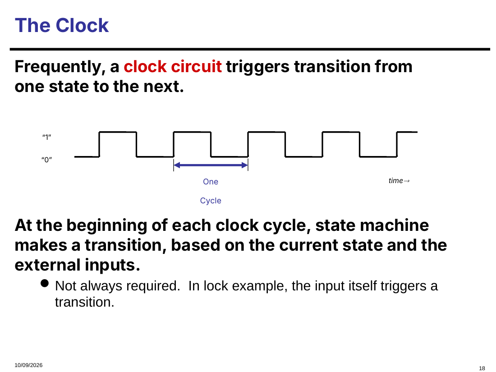
*图：第 18 页 · 时钟是 0/1 交替的周期信号*

- 一个高电平加一个低电平构成**一个周期**。
- 每个时钟周期开始时，状态机根据当前状态和外部输入完成一次转移。
- 时钟**并不总是必需的**：时序锁就是由"拨动"这个输入本身触发转移的。但计算机里几乎都用时钟驱动，而且每拍**一定**转移一次（哪怕是转移回自己）。

### 第 19–20 页：主从触发器（难点，要真正理解）

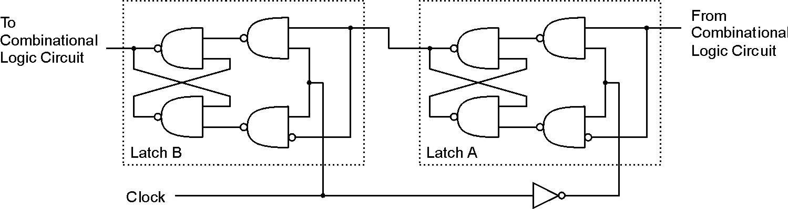
*图：第 19 页 · 主从触发器 = 两个门控 D 锁存器串联，时钟一个直接接、一个取反后接*

**先想清楚为什么需要它。** 假设只用一个门控 D 锁存器来存状态。锁存器在使能期间是"透明"的，输入一变，输出马上跟着变。于是：

> 新状态写进锁存器 → 立刻反馈给组合逻辑 → 组合逻辑又算出"下下个状态" → 又写进去 → ……

一个周期里状态连跳好几次，就失控了。

**解决办法：用两个锁存器，让它们在时钟的不同相位工作。** 图要**从右往左**看：

- 组合逻辑的输出进入 **Latch A（主）**，它的使能端接**取反后的时钟**，所以 clock = 0 时打开。
- Latch A 的输出进入 **Latch B（从）**，它的使能端**直接接时钟**，所以 clock = 1 时打开。
- Latch B 的输出送回组合逻辑。
- 两个锁存器**永远不会同时打开**，所以反馈环在任何时刻都是断开的。

两个阶段分别是：
- **clock = 1**：B 打开，把 A 里存好的值拷过来，成为"当前状态"送进组合逻辑；A 关闭，不受影响。
- **clock = 0**：A 打开，接收组合逻辑算出来的"下一状态"；B 关闭，当前状态保持稳定。

**第 20 页的时序图**（教材图 3.34），配合着看最清楚：

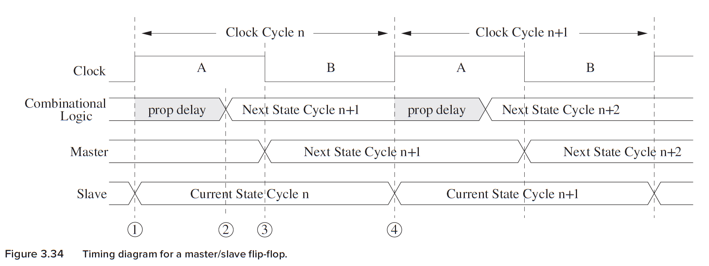
*图：第 20 页（第 31 页也有）· 主从触发器时序图*

| 时刻 | 发生什么 |
|---|---|
| ① | 时钟上升，Slave 更新为第 n 周期的当前状态 |
| ①→② | 组合逻辑的**传播延迟**（prop delay），这段时间输出还不稳定 |
| ② | 组合逻辑算好"第 n+1 周期的下一状态"，输出稳定 |
| ③ | 时钟下降，Master 打开，锁住这个下一状态 |
| ④ | 下一个上升沿，Slave 更新，进入第 n+1 周期 |

由此得到一个重要推论：**时钟高电平的时长必须大于组合逻辑的传播延迟**（② 必须在 ③ 之前），否则 Master 会锁住一个还没算完的错误值。这是时钟频率不能无限提高的根本原因之一。

> 一句话：**主从触发器把"算下一状态"和"更新当前状态"隔开在时钟的两个相位，保证每个周期状态只变一次。**

### 第 21 页：需要多少个触发器

每个主从触发器存 1 位状态。n 个状态至少需要 **⌈log₂ n⌉** 个触发器（假设用二进制编码状态）。

- 时序锁有 4 个状态，需要 2 位。
- 篮球记分牌：每队比分 7 位（最大 127）、分钟 5 位（最大 31）、秒 6 位（最大 63，够表示 0–59），再加 1 位球权箭头、1 位上下半场……每一项的位数都要能覆盖它的取值范围。

---

### 第 22–31 页：完整例子——闪烁交通标志（必须能独立做一遍）

这一段完整演示了设计状态机的标准四步：

> **状态图 → 真值表 → 逻辑表达式/电路 → 加上存储元件**

#### 第 22 页：需求

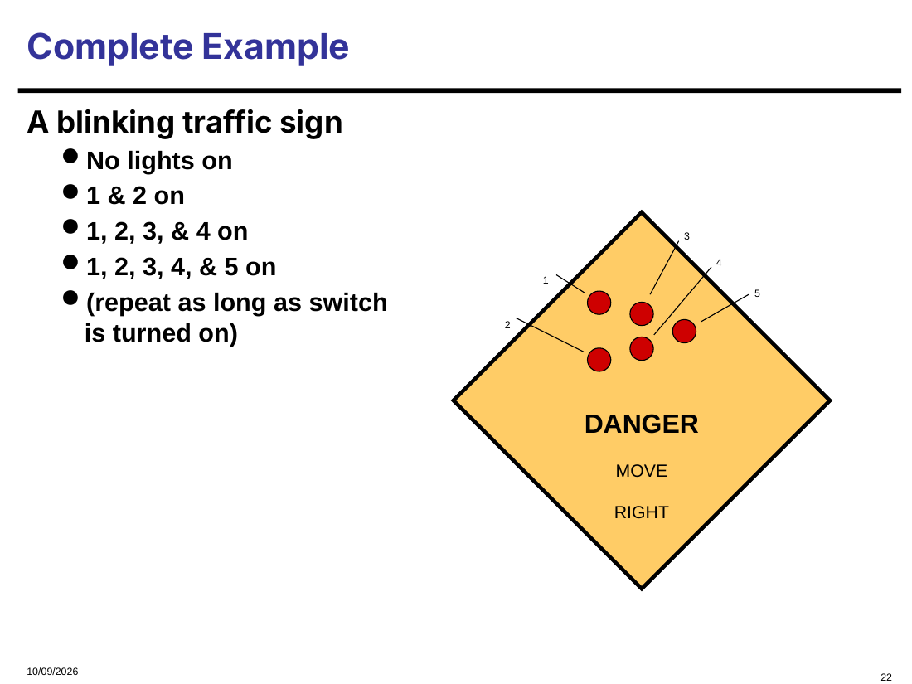
*图：第 22 页 · "DANGER MOVE RIGHT" 标志上的 5 盏灯*

开关打开时，灯按"全灭 → 1、2 亮 → 1–4 亮 → 1–5 全亮"的顺序循环，开关一直开着就一直循环。开关关掉时全灭。

#### 第 23–28 页：状态图

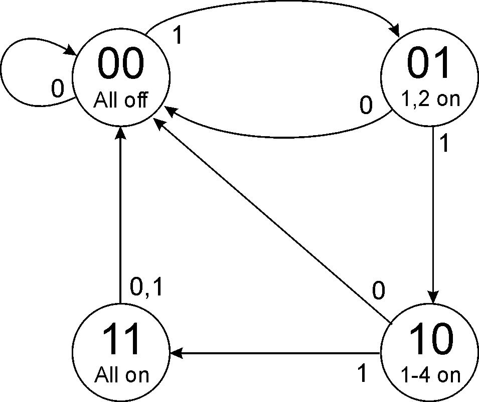
*图：第 23 页 · 交通标志状态图，箭头上标的是输入 In（开关）的值*

一共 4 个状态，用 2 位 **S1S0** 编码：

| 状态 S1S0 | 含义 | In = 1 时去 | In = 0 时去 |
|---|---|---|---|
| 00 | 全灭 | 01 | 00 |
| 01 | 1、2 亮 | 10 | 00 |
| 10 | 1–4 亮 | 11 | 00 |
| 11 | 全亮 | 00 | 00 |

- 状态 11 的箭头标的是 "0,1"：不管开关是开是关，下一拍都回到 00。
- **每个时钟周期转移一次。**

第 24–28 页是同一张图依次高亮 00 → 01 → 10 → 11 → 00，演示循环过程，看一遍就行。

#### 第 29 页：真值表（重点）

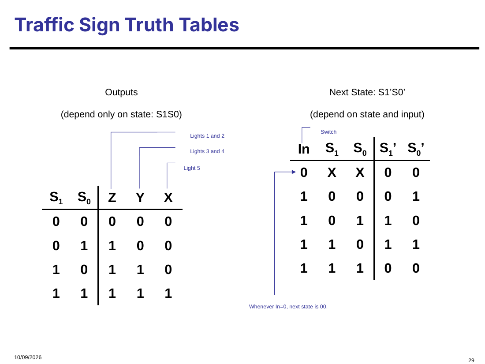
*图：第 29 页 · 左边是输出表，只依赖状态；右边是下一状态表，依赖状态和输入*

三个输出：**Z** 控制灯 1、2，**Y** 控制灯 3、4，**X** 控制灯 5。

**输出表（Moore 型）**直接读出：
- **Z = S1 + S0**（只要不是 00 就亮）
- **Y = S1**
- **X = S1 · S0**

**下一状态表**第一行的 X 是"无关项"：只要 In = 0，不管当前在哪个状态，下一状态都是 00。一行顶了四行，这是写真值表的常用技巧。

用积之和（SOP）写出所有为 1 的行，再化简：
- S0' = In·S̄1·S̄0 + In·S1·S̄0 = **In · S̄0**
- S1' = In·S̄1·S0 + In·S1·S̄0 = **In · (S1 ⊕ S0)**

**直观理解：** 开关开着的时候，S1S0 就是一个 2 位计数器，每拍加 1，到 11 之后溢出回 00。S0' 是 S0 取反，S1' 是 S1 异或上"低位进位" S0，这正是"加 1"的规则。开关一关，两位都清零。

这就和第 4 页的"**计数器 = 寄存器 + 自增器**"呼应上了：交通标志本质上是一个带清零的 2 位计数器，再加一个输出译码。

#### 第 30 页：逻辑电路

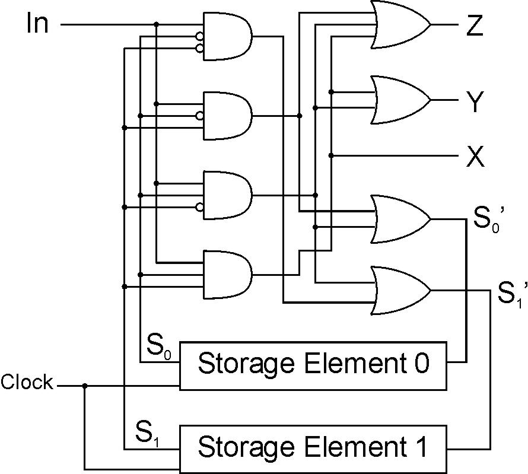
*图：第 30 页 · 左边一排与门产生乘积项，右边一排或门把它们加起来；S0'、S1' 进入存储元件，S0、S1 反馈回左边*

- 左边每个**与门**对应一个乘积项，右边的**或门**把乘积项相加，分别得到 Z、Y、X、S0'、S1'。
- S0'、S1' 接到 Storage Element 0/1，它们的输出 S0、S1 再反馈回与门。时钟同时接两个存储元件。
- 这张图就是第 17 页那张抽象结构图的具体实现。

> 这个电路是**按真值表直接用积之和搭出来的**，没有化简，所以门比用化简式要多。如果考试要求"画出电路"，用上面的化简式画更简单，两种都对。
>
> 另外注意：第 30 页和第 31 页里，右边下面两个或门的 S0'/S1' 标签是**对调**的。读图时以真值表为准，最好自己按化简式重新画一遍，就不会被搞混。

#### 第 31 页：展开存储元件，配上时序图

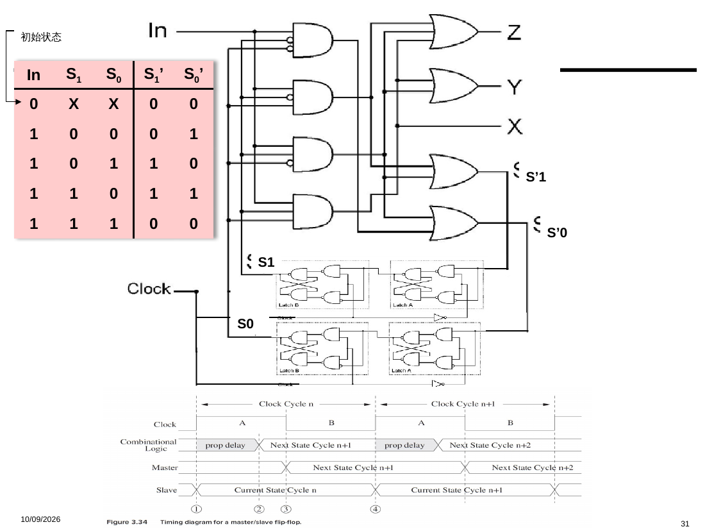
*图：第 31 页 · 把两个 Storage Element 展开成主从触发器（Latch B + Latch A），左边附下一状态表，下方是时序图*

这一页把第 19 页（触发器）和第 30 页（组合逻辑）合在了一起：**一个真正能工作的状态机，从门一直画到触发器。** 左上角的"初始状态"箭头指向 In = 0 那一行，意思是开关关着时（包括刚上电）状态被清成 00。

---

## 三、从逻辑到数据通路（第 32–34 页）· 点到为止

### 第 33 页：数据通路

**数据通路（data path）**是计算机里处理信息的全部逻辑，可以按电路类型分成两类：

- **组合逻辑**
  - 译码器：把指令转换成控制信号；
  - MUX：选择数据从哪来、到哪去；
  - ALU：对数据做运算。
- **时序逻辑**
  - **状态机**：协调控制信号和数据流动，它就是 CPU 的"控制器"，本讲学的东西从这里开始派上用场；
  - 寄存器和锁存器：存储。

### 第 34 页：LC-3 数据通路总览

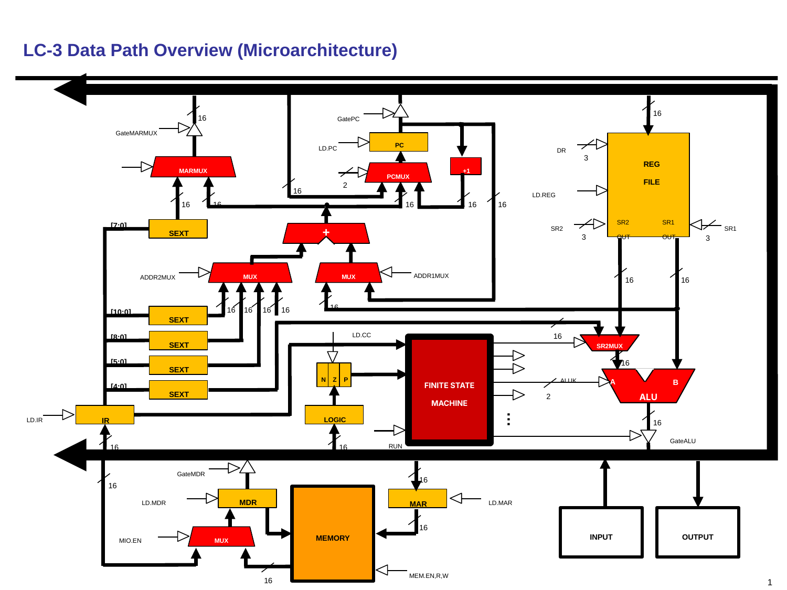
*图：第 34 页 · LC-3 数据通路，已去掉课件里的动画遮挡层*

课件在这页上用动画把数据通路划成了三大部件，这正是下一讲冯·诺依曼模型的内容：

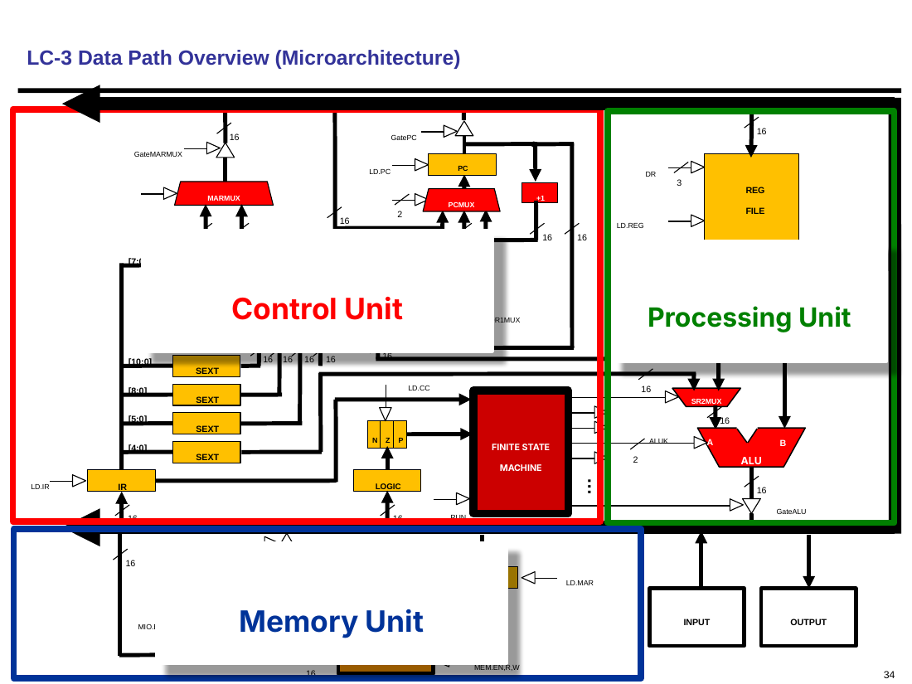
*图：第 34 页（动画后）· Control Unit / Processing Unit / Memory Unit*

现在只需要认识这些部件，第 4、5 章会逐条讲：
- **PC、IR、MAR、MDR、REG FILE（R0–R7）、ALU**：都是前面学过的寄存器、内存和组合电路。
- **LD.XXX**（LD.PC、LD.MAR、LD.REG……）：寄存器的"加载使能"，相当于 WE。
- **GateXXX**（GatePC、GateALU、GateMDR……）：图中的三角形是三态门，决定谁可以把数据放到总线（最粗的那圈线）上。**同一时刻只能有一个部件往总线上放数据。**
- **XXXMUX**（PCMUX、ADDR1MUX、SR2MUX……）：选择数据来源。
- **SEXT**：符号扩展，把 IR 里不同长度的立即数或偏移量扩展到 16 位。
- **N、Z、P**：条件码寄存器。
- 中间的 **FINITE STATE MACHINE**：给上面所有 LD、Gate、MUX 发控制信号的状态机。第 6 页说"计算机是一个状态机"，在这张图上看得最清楚。

---

## 四、总结与预告（第 35–40 页）· 略

**第 36 页 前两讲总结。**
- MOS 晶体管当开关用：N 型管接地，栅极为 1 时导通，把输出拉到 0；P 型管接 +2.9V（教材里的值），栅极为 0 时导通，把输出拉到 1。
- 最基本的门是 NOT、NOR、NAND。
- **完备性**：用与、或、非可以实现任何真值表。
- **德摩根定律**：把输入和输出都取反，AND 和 OR 就可以互换。

**第 37 页 本章总结。** 第 3 章从下往上搭了：晶体管 → 门 → 存储 → 状态机，以及加法器、计数器、交通标志这几个实例。

**第 38 页** 一张更老、更细的 LC-3 数据通路图，看一眼就行：

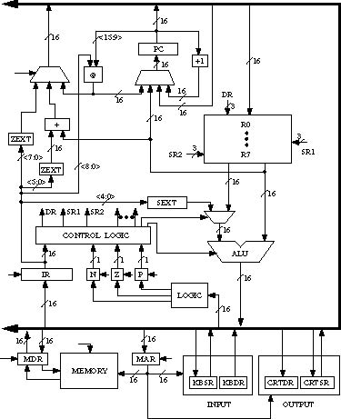
*图：第 38 页 · LC-3 数据通路旧版图*

**第 39 页 下次课预告。** 冯·诺依曼模型，阅读教材 4.0–4.2。

**第 40 页** 没有文字，是结束页。

---

## 本讲必须掌握的四件事

1. **组合逻辑和时序逻辑的区别**：有没有"状态"，也就是有没有记忆。
2. **FSM 五要素**；能画出、读懂状态图，并且保证每个状态在每种输入下都有去向。
3. **主从触发器为什么要两级**：把"算下一状态"和"更新当前状态"隔开，保证一个周期只变一次。要能结合时序图说清 ①–④ 四个时刻。
4. **状态机设计四步**：状态图 → 真值表 → 表达式 → 电路。交通标志要能自己从头推一遍。

## 自测题

1. 时序锁有 4 个状态。如果把它做成一个时钟驱动的电路，输入应该怎么编码？写出它的下一状态真值表。
2. 如果交通标志改成"全灭 → 1、2 亮 → 全亮"的三状态循环，需要几个触发器？多出来的那个编码怎么处理？
3. 如果把主从触发器换成单个门控 D 锁存器，交通标志在一次时钟高电平期间会出现什么现象？
